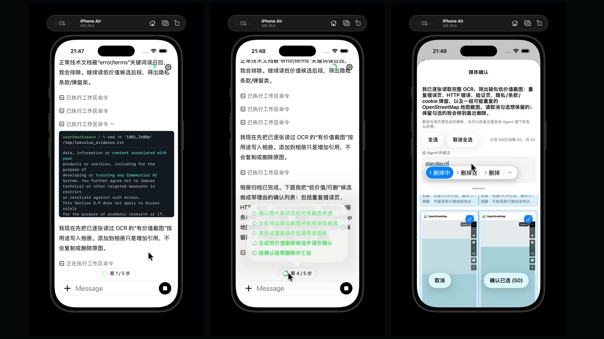

# Model Shell Protocol

The final form of software engineering is an app-owned operating environment
for models.

Model Shell Protocol, or MSP, defines that environment.

MSP is the operating-system semantics layer inside an application: a runtime
that turns app data, platform permissions, domain objects, user artifacts,
external services, and product-specific actions into files, commands, streams,
scripts, policies, and audit records that a model can operate on.

The claim is simple:

Every serious software product will eventually need an internal operating
system for AI agents.

Not a chatbot bolted onto the side. Not a pile of function schemas. Not raw
access to the host shell.

A real operating environment owned by the application.

MSP is that boundary.

At the largest scale, MSP can be the command runtime for whole agent-native
products across iOS, iPadOS, macOS, visionOS, Windows, Android, and the web. If
a platform lets an app access something, the app can project it into MSP as
workspace state, commands, streams, and policy-controlled capabilities.

At the smallest scale, MSP can power one vertical workflow: sorting photos,
reading PDFs, organizing notes, inspecting a codebase, operating a CRM,
navigating a design file, or automating a domain-specific workspace.

The Unix idea was that everything can be treated as a file.

MSP extends that idea for AI-native software: data as files, action as commands,
permission as policy, and execution as evidence.

That is why MSP is not a wrapper around `/bin/sh`.

It is the operating-system semantics layer inside the app.

## PhotoSorter Demo

PhotoSorter turns an iOS Photos Library into an MSP workspace. In this demo, an
agent organizes 600 real web-browsing screenshots into albums through the
app-owned MSP command runtime.

[](https://www.youtube.com/watch?v=rH_4GgYdCn4)

PhotoSorter came from a real backlog. My own iPhone photo library had been
accumulating for nine years and had grown to more than 50,000 photos and
screenshots. Using PhotoSorter over a few days, I was able to review, organize,
and clean up more than 10,000 items from that library.

That is the product-shaped proof behind MSP: private app data can become an
agent-operable workspace without handing the model a raw host shell or an
uncontrolled dump of personal files.

## Playground Demo

`Examples/iOS/MSPPlaygroundApp` is the developer-facing companion to
PhotoSorter. It shows the same MSP runtime in a smaller app workspace with chat,
shell commands, Python, Git, and patch application.

In this demo, the model inspects messy event materials, edits the recap with
`apply_patch`, updates a checklist, creates a summary, and records the result
with Git.


## The Bet

The next software platform will not be a chat box with plugins.

It will be an app-owned operating environment where agents can inspect state,
run commands, create artifacts, compose workflows, and leave evidence behind.

Shell is not a nostalgic interface choice. It is one of the most mature
abstractions in software history.

For decades, commands, files, streams, exit codes, scripts, logs, composition,
and automation have powered operating systems, servers, developer tools, CI
systems, deployment pipelines, debugging sessions, and production operations.
That model survived because it is small, composable, inspectable, scriptable,
and teachable.

MSP brings that mature interaction model into applications, without handing the
model the raw host machine, and gives it modern boundaries:

- virtual workspaces instead of raw host filesystem access
- app-defined command packs instead of arbitrary machine control
- policy and audit as first-class runtime concepts
- platform adapters for iOS, iPadOS, macOS, visionOS, Android, Windows, and beyond
- conformance fixtures instead of one-off integration behavior

MSP is not a library feature. It is the software boundary between AI agents and
applications: the command runtime where app capabilities become model-operable
software.

## The Emergence Thesis

The power of shell is not that any single command is intelligent.

Most commands are small. `cat` reads. `grep` filters. `sort` orders. `tee`
copies. `find` walks. Each primitive is limited on its own.

The power comes from composition.

This is the emergence thesis behind MSP: simple local primitives become
powerful when they interact through a shared medium.

In shell, that medium is files, streams, exit codes, environment variables, and
a common syntax. Commands can be connected through pipes, redirected through
files, embedded in scripts, checked by exit codes, and recombined into
workflows that no single command was designed to handle.

MSP applies the same thesis inside applications.

An app command can be small too: read a photo, classify an image, search notes,
summarize a PDF, create an album, update a record, render a transcript. Once
those capabilities share WorkspaceFS paths, stdin, stdout, scripts, policies,
and audit records, they stop being isolated features. They become a composable
operating environment for the model.

## Core Principles

```text
Data as files.
Action as commands.
Permission as policy.
Execution as evidence.
```

These are not slogans for the UI. They are the shape of the runtime.

The model should be able to inspect real workspace artifacts. App capabilities
should be exposed as commands. Permission decisions should live in explicit
policy layers. Execution should leave records that humans, tests, and future
agents can inspect.

## Not A Wrapper Around The System Shell

MSP does not hand `/bin/sh`, `bash`, or `zsh` to the model.

The shell parser, command dispatch, expansion behavior, redirection handling,
WorkspaceFS path resolution, command registry, policy checks, audit records, and
app capability boundaries are implemented inside MSP.

That distinction is the point.

A real system shell is powerful, but it is also host-specific, process-oriented,
unsafe by default, difficult to sandbox consistently across platforms, and tied
to machine paths and binaries that an app may not control.

MSP keeps the shell interaction model while replacing the execution substrate.

The model sees shell-like command text. The app owns the runtime.

## Why Commands Beat Tool Schemas

MSP is built on a simple bet:

AI agents are better suited to a command environment than to an endless catalog
of bespoke tool schemas.

Shell commands are already one of the most heavily represented software
interfaces in the training distribution of modern coding models. Models have
seen shell scripts, terminal sessions, man pages, CI logs, README examples,
build scripts, deployment scripts, and debugging transcripts.

That matters.

A command like this is not just a function call:

```text
find /notes -name "*.md" | xargs grep "invoice" > /reports/matches.txt
```

It carries decades of software convention:

- paths
- streams
- pipes
- redirection
- exit codes
- globbing
- quoting
- stdin and stdout
- composable text transformation
- inspectable intermediate files

Traditional tool calling gives the model a list of isolated API endpoints. MSP
gives the model an operating grammar.

Tool calling gives agents hands. MSP gives agents a software environment.

## Beyond Tool Protocols

MCP and function calling make tools reachable.

MSP makes capabilities composable.

Those are different layers. A tool protocol can tell a model that a function
exists. It can describe input JSON and return output JSON. But the composition
layer is still weak: every new combination tends to require another tool,
another schema, another adapter, or more reasoning burden inside the model.

MSP moves composition into the runtime.

Once a capability is registered as a command, it can participate in the same
environment as every other command: pipes, redirection, files, scripts, command
substitution, exit codes, and generic Linux-style utilities.

This is the difference between giving the model buttons and giving it a command
line.

## App Commands Become Shell Primitives

MSP does not limit applications to a fixed generic command set.

An app can register its own domain-specific commands into the same command
runtime as the Linux-like core command pack. Once registered, those commands are
not isolated tool calls. They become shell primitives.

That means app-specific capabilities can be combined with:

- pipes
- redirection
- glob patterns
- workspace files
- stdin and stdout
- exit codes
- command substitution
- scripts and multi-step workflows
- generic commands such as `cat`, `grep`, `find`, `sort`, `xargs`, and `tee`

This is where the leverage compounds.

A traditional tool has a fixed schema. It usually accepts a narrow input shape
and returns a narrow output shape. The model can call it, but composition mostly
happens outside the runtime.

A command is different. If it reads files, writes files, accepts stdin, emits
stdout, and follows exit-code conventions, it can participate in larger
workflows without the app author designing a new API for every combination.

Tools are endpoints. Commands are building blocks.

MSP turns app capabilities into composable runtime vocabulary.

## Production Validation: ReadOS and Readex

MSP is not only a theoretical interface or SDK exercise.

Its strongest validation comes from ReadOS, a production learning and work
environment where Readex is the AI agent operating inside the user's workspace.
ReadOS itself is not part of this open-source repository, but it is the product
experience that shaped MSP.

ReadOS is not publicly launched yet. It is expected to be introduced soon, and
this repository publishes the MSP standard and SDK work that grew out of that
product direction before the full ReadOS product is released.

Readex proves the central MSP idea in a real application: an agent should not be
limited to a chat box or a scattered set of isolated tools. It should work inside
an app-owned operating environment where user materials, app capabilities,
generated artifacts, long-running tasks, and prior work all become part of one
coherent command runtime.

In ReadOS, Readex can work with many kinds of user resources:

- documents and PDFs
- webpages and saved web references
- videos, subtitles, frames, and downloaded media
- text notes and structured files
- images and generated artifacts
- prior conversations
- knowledge structures created around learning materials
- workspace files produced by previous agent actions

The important point is not that each capability exists as a separate button or
function call. The important point is that these capabilities can be expressed
through a command layer owned by the application.

That lets Readex do work such as:

- inspect a workspace before answering
- read source materials instead of guessing
- extract focused evidence from PDFs or videos
- turn generated outputs into persistent workspace files
- refer back to prior conversations as reusable artifacts
- organize knowledge around documents rather than only chat history
- combine app-specific actions with familiar command-line composition
- leave behind results that humans and future agents can inspect

This is the difference MSP is trying to standardize.

A traditional agent integration exposes tools as endpoints. ReadOS exposes an
environment. Readex does not merely call one-off APIs; it operates through a
command runtime where files, streams, commands, artifacts, policies, and evidence
all share the same interaction model.

ReadOS is the production product. Readex is the agent experience inside it. MSP
is the open standard and SDK work shaped by that product experience.

## Current Status

This repository is the open MSP standard and SDK work, shaped by the production
experience of ReadOS and Readex. It is still under active construction.

The current Swift implementation includes:

- a `ModelShellProxy` facade
- a WorkspaceFS boundary backed by an app-provided workspace directory
- a hand-written MSP shell parser and runtime layer
- a POSIX-like core command pack
- policy and audit extension points
- an agent bridge for command execution
- Swift unit and integration tests
- conformance fixtures and reference outputs
- iOS example applications

This repository does not contain the full ReadOS product source code. ReadOS and
Readex are referenced here as production validation for the MSP model, not as an
open-source reference implementation.

This is not yet a final MSP v1 compatibility claim. Shell/runtime parity,
cross-platform implementations, oracle refresh workflows, and polished example
apps are still ongoing work.

## Requirements

For the Swift package and command-line checks:

- Swift 5.9 or newer
- Xcode command line tools on macOS for the most tested local path

For the checked-in iOS examples:

- an Xcode/iOS SDK that can build `IPHONEOS_DEPLOYMENT_TARGET = 26.0`
- an iPhone or iPad that can run that target for direct device runs
- an Apple development team or local signing override for device builds

Optional runtime assets are configured only when needed. The source tree does
not vendor CPython frameworks, FastVLM model bundles, local MLX/FastVLM
checkouts, personal signing settings, or model credentials.

## Quick Start

From the repository root, run the active Swift package tests:

```sh
swift test
```

That is the fastest way to exercise the current public MSP runtime surface:
parser, command dispatch, WorkspaceFS behavior, policy hooks, audit records,
Python profile boundaries, and integration tests.

To inspect a product-shaped integration, start with
`Examples/iOS/MSPPlaygroundApp`. It shows MSP in an app loop with chat,
transcript state, workspace browsing, command execution, and app-owned runtime
boundaries.

To prepare direct iOS device runs, create a local signing override once:

```sh
Examples/iOS/Tools/bootstrap-ios-examples.sh \
  --team ABCDE12345 \
  --bundle-prefix com.yourname.msp
```

The script writes ignored local signing settings and populates the CPython iOS
cache used by the example app build phases. After that, open either checked-in
Xcode project, select your connected iPhone or iPad, and press Run. Xcode may
still ask you to sign in with an Apple ID or trust the device; the repository
does not ship a personal development team or provisioning profile.

The checked-in iOS app targets currently use `IPHONEOS_DEPLOYMENT_TARGET = 26.0`.
Use an Xcode/iOS SDK that can build that target and a device that can run it.

Simulator builds do not need signing setup:

```sh
xcodebuild \
  -project Examples/iOS/MSPPlaygroundApp/Project/MSPPlaygroundApp.xcodeproj \
  -scheme MSPPlaygroundApp \
  -configuration Debug \
  -sdk iphonesimulator \
  build

xcodebuild \
  -project Examples/iOS/PhotoSorter/Project/PhotoSorter.xcodeproj \
  -scheme PhotoSorter \
  -configuration Debug \
  -sdk iphonesimulator \
  build
```

For command-line device builds, either run the bootstrap once or pass the same
values as Xcode build settings:

```sh
xcodebuild \
  -project Examples/iOS/MSPPlaygroundApp/Project/MSPPlaygroundApp.xcodeproj \
  -scheme MSPPlaygroundApp \
  -configuration Debug \
  -sdk iphoneos \
  -destination 'generic/platform=iOS' \
  MSP_EXAMPLE_DEVELOPMENT_TEAM=ABCDE12345 \
  MSP_EXAMPLE_BUNDLE_ID_PREFIX=com.yourname.msp \
  build

xcodebuild \
  -project Examples/iOS/PhotoSorter/Project/PhotoSorter.xcodeproj \
  -scheme PhotoSorter \
  -configuration Debug \
  -sdk iphoneos \
  -destination 'generic/platform=iOS' \
  MSP_EXAMPLE_DEVELOPMENT_TEAM=ABCDE12345 \
  MSP_EXAMPLE_BUNDLE_ID_PREFIX=com.yourname.msp \
  build
```

Both iOS example READMEs document their optional real-model E2E checks and
their CPython runtime smoke tests.

## Where To Start

If you want to understand the standard, start with `Spec/`. For the long-term
SDK target, start with `Spec/Profiles/MSPModelWorkspaceExecutionSDKProfile.md`.

If you want to understand what is currently implemented, start with
`Implementations/Swift/Sources/ModelShellProxy/`, then read `MSPCore`,
`MSPShellLanguage`, `MSPShellExpansion`, `MSPShell`, and `MSPPOSIXCore`.

If you want to understand behavior coverage, start with `Conformance/Inventory`
and `Conformance/Fixtures`.

If you want to see MSP in an app shape, start with `Examples/iOS/MSPPlaygroundApp`.

If you want to understand the architectural origin, read `References/`, but
treat it as reference material rather than the active source layout.

## License

Apache-2.0. See [LICENSE](LICENSE) and [NOTICE](NOTICE).

## Stage Closeout Baseline

The current open-source baseline is a stage closeout, not the final MSP
compatibility certification.

Before publishing this stage, keep these gates green:

```sh
PYTHONDONTWRITEBYTECODE=1 python3 Conformance/Scripts/run_open_source_release_dry_run.py
```

The release dry-run copies the current publishable worktree surface, including
tracked files and untracked non-ignored files, into a temporary release tree.
It then runs the open-source example boundary gate, the open-source hygiene
gate, and default SwiftPM tests for the two iOS examples against that copied
tree.

Publish from that Git/dry-run boundary, not by zipping the raw working
directory. Ignored local inputs such as FastVLM source/model files, local Xcode
projects, signing overrides, build caches, and validation scratch output are not
part of the public source release. Keep `NOTICE` with the source release; it
records the current third-party, vendored-binary, generated-evidence, and app
binary distribution boundaries.

The default example tests are source-only checks. They may report expected
skips for optional capabilities that need local runtime artifacts: PhotoSorter
CPython runtime tests need a configured CPython framework, and the
MSPPlaygroundApp host `apply_patch` bridge test needs a locally built dynamic
library. The example READMEs document how to run those optional checks from a
clean clone.

The hygiene gate rejects local build output, Python bytecode, Finder metadata,
loose runtime artifacts, non-publishable oracle dumps, and generated validation
outputs. Codex CLI validation scripts should write machine-readable
results under `.build/codex-cli-validation/results` by default, or under
`CODEX_CHAT_VALIDATION_RESULTS_ROOT` when that environment variable is set. Run
ad-hoc Python validation with `PYTHONDONTWRITEBYTECODE=1` so local syntax checks
do not create `__pycache__/` folders in the publishable tree.

The source tree does not vendor BeeWare CPython binaries, FastVLM model
bundles, or local MLX/FastVLM source checkouts. If you distribute an app binary
that embeds CPython or opt-in local model/runtime artifacts, review and include
the applicable third-party notices for that binary distribution.

When real-model credentials, simulator access, and required CPython assets are
available, the exec-session release gate is:

```sh
MSP_PLAYGROUND_MODEL_BASE_URL=... \
MSP_PLAYGROUND_MODEL_API_KEY=... \
MSP_PLAYGROUND_MODEL=gpt-5.5 \
  Conformance/Scripts/run_final_exec_session_release_gate.sh
```

That gate is stronger than a local smoke test, but it is still scoped to the
exec-session release profile. The long-term SDK target remains
`Spec/Profiles/MSPModelWorkspaceExecutionSDKProfile.md`, and its report must
continue to name the final conformance classes that are not certified by this
stage.

## Repository Layout

```text
ModelShellProxy/
|-- Package.swift
|-- Spec/
|   |-- AgentBridge/
|   |-- Chat/
|   |-- WorkspaceFS/
|   |-- Profiles/
|   |-- Commands/
|   |-- ExternalRunners/
|   |-- Extensions/
|   |-- Security/
|   `-- Audit/
|-- Conformance/
|   |-- AgentBridge/
|   |-- Chat/
|   |-- Fixtures/
|   |-- Inventory/
|   |-- OracleCapture/
|   |-- ReferenceOutputs/
|   |-- Golden/
|   `-- Scripts/
|-- Implementations/
|   |-- Swift/
|   |   `-- Sources/
|   |       |-- ModelShellProxy/
|   |       |-- MSPCore/
|   |       |-- MSPShellLanguage/
|   |       |-- MSPShellExpansion/
|   |       |-- MSPShell/
|   |       |-- MSPPOSIXCore/
|   |       |-- MSPPythonRuntime/
|   |       |-- MSPPythonEmbeddedRuntime/
|   |       |-- MSPApple/
|   |       |-- MSPAgentBridge/
|   |       |-- MSPCommandKit/
|   |       |-- MSPExternalRunner/
|   |       |-- MSPGit/
|   |       |-- MSPChat/
|   |       |-- MSPChatCommands/
|   |       |-- MSPAgentChatStore/
|   |       |-- MSPCodexApplyPatchRuntime/
|   |       |-- MSPChatValidatorCLI/
|   |       |-- MSPPtySupport/
|   |       `-- Tools/
|   |-- AndroidKotlin/
|   `-- Windows/
|-- Examples/
|   |-- iOS/
|   |   |-- EXAMPLE_CHAT_TRANSCRIPT_RENDERER_MANIFEST.md
|   |   |-- Shared/
|   |   |-- Tools/
|   |   |-- MSPPlaygroundApp/
|   |   `-- PhotoSorter/
|   |-- Apple/
|   |   |-- CustomCommandDemo/
|   |   |-- ExternalRunnerDemo/
|   |   |-- iOSMinimalApp/
|   |   `-- macOSCommandLineDemo/
|   |-- Android/
|   `-- Windows/
|-- Docs/
|   |-- SDK/
|   |-- DemoCandidates/
|   `-- Standards/
|-- Tests/
|   |-- Swift/
|   |   |-- Fixtures/
|   |   |-- Golden/
|   |   |-- Unit/
|   |   `-- Integration/
|   `-- SpecConformance/
|-- Tools/
|   `-- RequestParity/
`-- References/
    |-- LinuxSourceSnapshot/
    |-- ReadexShellSnapshot/
    `-- ReadexReadingAgentSnapshot/
```

Generated build directories, local scratch directories, and temporary artifacts
are intentionally omitted from this tree.

## What Each Directory Means

`Spec/` defines the public MSP contract. It describes the agent bridge, `.chat`
conversation packages, WorkspaceFS, profiles, security model, external runner
boundary, and command-layer expectations.
`Spec/Profiles/MSPModelWorkspaceExecutionSDKProfile.md` defines the long-term
model-workspace execution SDK target, including Readex reference boundaries,
backend classes, Python/subprocess requirements, Linux oracle parity, and
real-model pressure-test gates.

`Conformance/` contains the evidence layer for the spec. It includes required
command fixtures, `.chat` validation evidence, inventories, oracle outputs,
parity cases, and scripts used to check behavior against Linux-like references.

`Implementations/` contains runtime implementations. Swift is the active
implementation today. Android and Windows are reserved for future platform work.

`Implementations/Swift/Sources/ModelShellProxy/` is the public Swift facade. It
wires shell parsing, command dispatch, workspace state, policy, audit, and
profile registration into one SDK entry point.

`Implementations/Swift/Sources/MSPCore/` contains shared runtime primitives:
commands, command results, policy requests, audit records, workspace protocols,
path resolution, and filesystem types.

`Implementations/Swift/Sources/MSPShellLanguage/` and
`Implementations/Swift/Sources/MSPShellExpansion/` contain shell syntax parsing,
AST structures, redirection syntax, reconstruction, word expansion, pattern
matching, and parameter expansion.

`Implementations/Swift/Sources/MSPShell/` composes the shell language and
expansion layers into the runtime shell support used by MSP.

`Implementations/Swift/Sources/MSPPOSIXCore/` contains the POSIX-like command
pack, including filesystem, text, search, comparison, metadata, data, numeric,
process, and utility commands.

`Implementations/Swift/Sources/MSPPythonRuntime/` defines the optional Python
command profile. It owns Python invocation planning, command registration, and
the shared `MSPPythonRuntime` backend protocol.

`Implementations/Swift/Sources/MSPPythonEmbeddedRuntime/` contains the
in-process Python backend boundary for iOS, iPadOS, macOS, and visionOS. The
current CPython engine dynamically binds to an app-supplied CPython library; it
does not make Python part of the default POSIX core profile. Python subprocess
entry points such as `subprocess.run(...)` are routed back through MSP command
execution so child commands stay inside the same workspace, policy, and audit
boundary.

`Implementations/Swift/Sources/MSPApple/` adapts Apple platform storage into an
MSP workspace. The agent sees virtual paths rooted at `/`; the app owns the real
directory and policy.

`Implementations/Swift/Sources/MSPAgentBridge/` connects model requests to the
MSP command surface. It keeps the model-facing interface small while preserving
structured command results internally.

`Implementations/Swift/Sources/MSPGit/` contains optional Git-backed runtime
support exposed as a Swift package library.

`Implementations/Swift/Sources/MSPChat/`,
`Implementations/Swift/Sources/MSPChatCommands/`, and
`Implementations/Swift/Sources/MSPAgentChatStore/` contain the current `.chat`
package reader/writer, validator, `chat read` command pack, and agent chat store
helper.

`Implementations/Swift/Sources/MSPCodexApplyPatchRuntime/` contains the optional
Codex-compatible `apply_patch` bridge runtime. `MSPPtySupport`,
`MSPChatValidatorCLI`, and `Implementations/Swift/Sources/Tools/` are support
surfaces used by public libraries, executables, or platform bridges.

`Examples/` contains app-shaped demonstrations. These are not just snippets;
they show how MSP fits into real product loops such as chat, transcript
timelines, workspace browsing, and app-specific commands.

The two main iOS examples cover different backend classes:

- `Examples/iOS/MSPPlaygroundApp` is the developer-facing app loop for ordinary
  host-backed and mixed workspace work. Start here when integrating MSP into an
  app that owns a normal workspace directory.
- `Examples/iOS/PhotoSorter` is the virtual-backend example. It projects the iOS
  Photos Library into workspace paths and proves that app-owned system resources
  can still participate in shell-like agent workflows.

The two iOS examples share a scoped transcript UI renderer under
`Examples/iOS/Shared/ExampleChatTranscriptRenderer`; its boundary is documented
in `Examples/iOS/EXAMPLE_CHAT_TRANSCRIPT_RENDERER_MANIFEST.md`. That renderer is
example UI support, not an MSP protocol or SDK target.

`Docs/` contains SDK notes and future demo concepts. The demo candidates explain
how MSP can support vertical apps beyond document workflows. `Docs/Standards/`
contains standardization notes that are not source modules.

`Tests/` contains Swift unit tests, Swift integration tests, and spec conformance
tests. The test layout is intentionally separate from implementation folders so
the standard and runtimes can evolve independently.

`Tools/` contains repository-level helper tools that are not Swift package
libraries, including request-parity runner support.

`References/` contains read-only source material and historical snapshots. These
snapshots are preserved for comparison, migration, and conformance work. They
are not the active MSP source layout and they are not an open-source release of
ReadOS or Readex.

## Swift Package Modules

The Swift package currently exposes these libraries:

- `ModelShellProxy`
- `MSPCore`
- `MSPShellLanguage`
- `MSPShellExpansion`
- `MSPShell`
- `MSPCommandKit`
- `MSPExternalRunner`
- `MSPGit`
- `MSPAgentBridge`
- `MSPPOSIXCore`
- `MSPPythonRuntime`
- `MSPPythonEmbeddedRuntime`
- `MSPApple`
- `MSPChat`
- `MSPChatCommands`
- `MSPAgentChatStore`
- `MSPCodexApplyPatchRuntime`

It also exposes these command-line products:

- `msp-chat-validate`
- `msp-request-parity-runner`

The common Apple-platform entry point is:

```swift
let shell = try ModelShellProxy
    .iOS(workspaceURL: workspaceURL)
    .enable(.posixCore)
```

Python is optional and must be enabled explicitly:

```swift
let pythonEngine = try MSPCPythonEngine(
    library: .path(cpythonLibraryURL),
    workspaceRootURL: workspaceURL,
    pythonHomeURL: cpythonHomeURL
)

let shell = try ModelShellProxy
    .iOS(workspaceURL: workspaceURL)
    .enable(.posixCore)
    .enable(.python(runtime: MSPPythonEmbeddedRuntime(engine: pythonEngine)))
```

An agent runtime can connect to the shell through:

```swift
let bridge = shell.execCommandBridge()
```

The agent-facing tool remains intentionally small:

```text
exec_command({ "cmd": "ls -la /" })
```

Internally, MSP can still preserve structured command results, audit records,
policy decisions, workspace state, and test fixtures.
